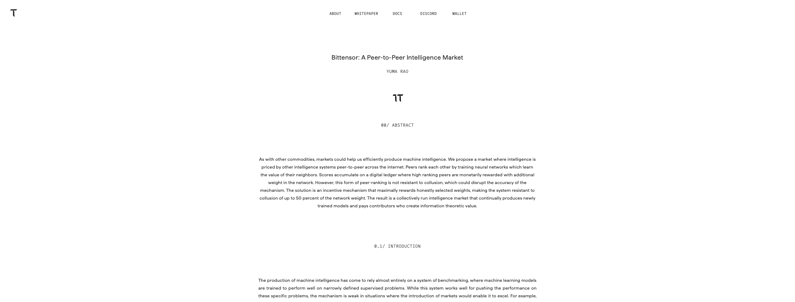
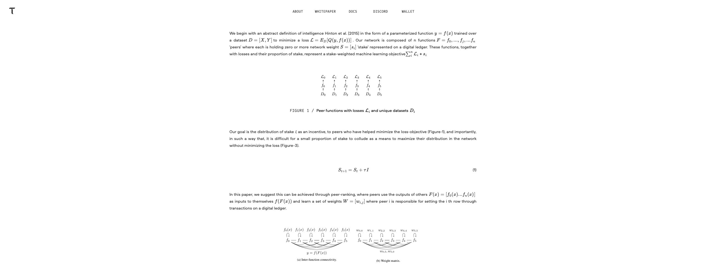
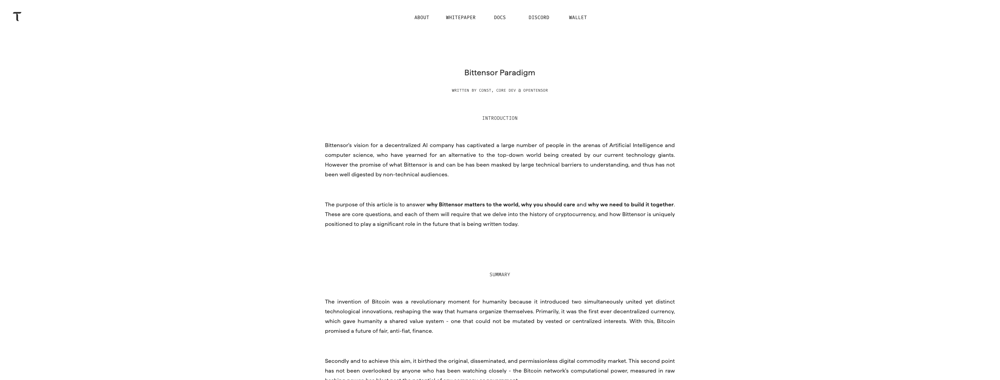

# Bittensor Reference — 2026-06-18

## Purpose

This appendix pins the Bittensor visual state used to develop the Affine Alignment Mirror direction.

Reference date:

```text
2026-06-18
```

Reference site:

```text
https://www.bittensor.com/
```

The source site can change. These captures, not the current live site, are the canonical reference for this version of the Affine direction.

If a future Bittensor state should influence Affine, create a new dated appendix and explicitly update the Doctrine and Visual System. Do not replace this reference silently.

## Captured Views

The four capture files live beside this document in `uploads/` and are part of the handoff package.

### Landing

File: [`image.png`](image.png)


Observed:

- white field across the viewport
- tiny tau mark near the upper-left corner
- tiny centered navigation
- one centered, monochrome network object
- no headline, CTA, card, gradient, partner strip, or decorative frame
- the majority of the viewport is unoccupied

Affine translation:

- black field
- everyday gold mark in navigation
- full-spectrum Affine monument at the optical center
- one restrained theorem line
- no additional marketing structure

### Whitepaper Opener

File: [`image-508fec0d.png`](image-508fec0d.png)



Observed:

- small centered title and author line
- large vertical interval before the abstract
- narrow reading column
- centered section label
- restrained body scale
- no callout cards or side navigation

Affine translation:

- blackpaper title block
- mono numbered section label
- narrow white theorem column
- generous section spacing
- one proof figure or equation interrupting the text

### Equation and Figure Rhythm

File: [`image-92d8c1a6.png`](image-92d8c1a6.png)



Observed:

- equations and figures occupy their own vertical fields
- captions are small and matter-of-fact
- body paragraphs remain narrow
- mathematical material acts as primary content rather than decoration
- horizontal space around figures is larger than the inked object

Affine translation:

- mechanism diagrams receive the same authority as prose
- evaluation, resolution, and inheritance must be labeled
- gold may identify the inherited state only
- equations must correspond to real system behavior

### Longform Article

File: [`image-fb8302eb.png`](image-fb8302eb.png)



Observed:

- centered title, author, and section labels
- substantial gaps between conceptual sections
- plain body copy with little surface decoration
- a slow reading rhythm created by placement, not type spectacle

Affine translation:

- rationale pages should feel placed rather than streamed
- two to four paragraphs per conceptual block
- 96–128px conceptual gaps at desktop scale
- restrained titles and explicit proof moments

## Approximate Measurements

The captures are approximately 2560px wide. These measurements are observational, not Affine production tokens.

| Feature | Observed range | Affine lesson |
| --- | ---: | --- |
| top navigation text | roughly 10–12px | keep navigation protocol-small |
| top navigation position | roughly 28–40px from top | avoid a large marketing header |
| longform reading width | roughly 700–760px | use a narrow centered column |
| title/body separation | roughly 120–200px | let major concepts breathe |
| figure field | roughly 800–1000px | give diagrams more width than prose |
| occupied landing area | substantially below half the viewport | silence is structural |

Do not reproduce these values mechanically. Use the Affine tokens in the Visual System and preserve the observed relationships:

- navigation is much smaller than the identity object
- reading columns are much narrower than the viewport
- vertical gaps are larger than conventional landing-page spacing
- figures are isolated enough to become arguments
- empty space carries more visual weight than chrome

## What Affine Mirrors

- restraint
- centered composition
- symbolic first viewport
- tiny navigation
- narrow longform columns
- academic section labels
- equations and figures as primary material
- authority through silence

## What Affine Must Not Copy

- tau or any Bittensor-owned mark
- Bittensor diagrams, equations, or paper text
- exact navigation labels
- exact font files without licensing
- the white palette
- the incentive-market identity
- any later live-site change not captured and versioned

## Review Note

The mirror is successful when the relationship is structural rather than cosmetic.

Bad:

> Bittensor, but black.

Good:

> A related protocol artifact whose opposite role—alignment and inheritance—has produced its own visual grammar.
